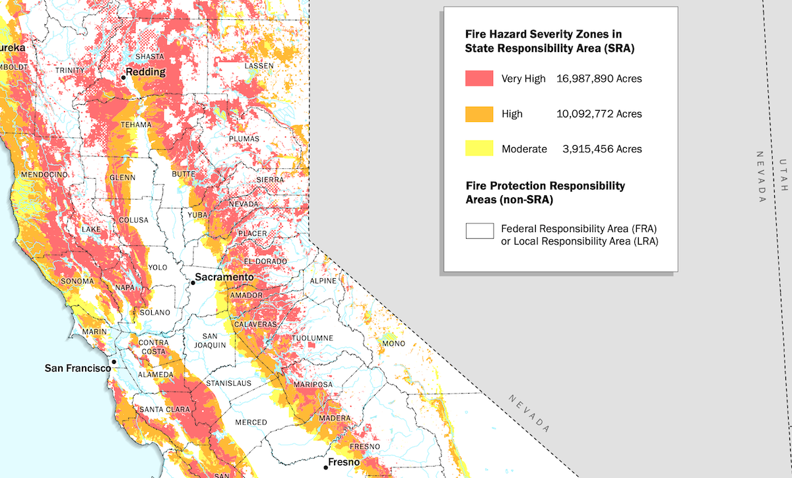
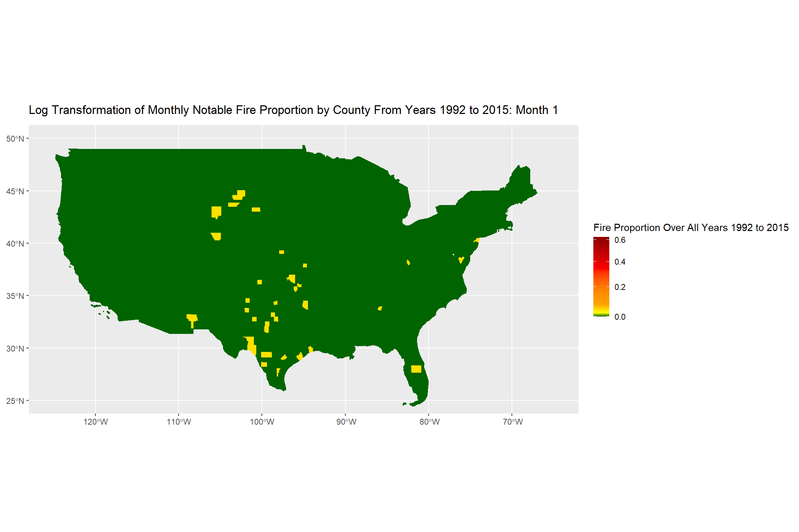

```{r setup, include=FALSE}
knitr::opts_chunk$set(echo = TRUE)
```


```{r}
#Reference to css style I used to format the document. https://www.w3schools.com/htmL/html_css.asp
```


```{r, include = FALSE}
library(tigris)
library(tidyverse)
library(dplyr)
library(ggplot2)
library(maps)
library(sf)
library(randomForest)
library(xgboost)
library(pROC)
library(PRROC) 
library(Matrix)
library(gifski)
library(gganimate)
library(rmapshaper)
library(kableExtra)
```

```{r, include = FALSE, cache = TRUE}
Wildfires <- read.csv("wildfires_sample_100k.csv")

#For the sake of this project we will be filtering to only "noteable" fires, thus fires with final burned area greater than 300 acres.
#Additionally, ICS_209_NAME, MTBS_ID, MTBS_FIRE_NAME, COMPLEX_NAME, FIPS_NAME, Shape, CONT_DATE, CONT_DOY, CONT_TIME,
# SOURCE_SYSTEM_TYPE, SOURCE_SYSTEM, NWCG_REPORTING_AGENCY, NWCG_REPORTING_UNIT_ID, NWCG_REPORTING_UNIT_NAME, SOURCE_REPORTING_UNIT,
#SOURCE_REPORTING_UNIT_NAME, FOD_ID,FPA_ID, FIRE_CODE, LOCAL_INCIDENT_ID, ICS_209_INCIDENT_NUMBER, LOCAL_FIRE_REPORT_ID, STAT_CAUSE_CODE, FIRE_NAME
#FIRE_SIZE_CLASS, DISCOVERY_TIME, FIPS_CODE and OWNER_DESCR will be dropped as they are not relevant for the sake of prediction.
#While the rational specifically varies, all of these tags are either redundant, contain ID or Identifiers that we no longer need,
#contain a classification not needed for prediction, and or get removed due to us predicting the probability that a wildfire will
#occur in a given geographic area during a future month which shifts the "unit" away from hour of day units.

Notable_Wildfires <- Wildfires %>%
  filter(FIRE_SIZE >= 300) %>%
  select( -ICS_209_NAME, -MTBS_ID, -MTBS_FIRE_NAME, -COMPLEX_NAME, -FIPS_NAME, -Shape, -CONT_DATE, -CONT_DOY, -CONT_DATE, -CONT_DOY, -CONT_TIME,
          -SOURCE_SYSTEM_TYPE, -SOURCE_SYSTEM, -NWCG_REPORTING_AGENCY, -NWCG_REPORTING_UNIT_ID, -NWCG_REPORTING_UNIT_NAME, -SOURCE_REPORTING_UNIT, -SOURCE_REPORTING_UNIT_NAME,
         -FOD_ID, -FPA_ID, -FIRE_CODE, -LOCAL_INCIDENT_ID, -ICS_209_INCIDENT_NUMBER,-OWNER_DESCR, -LOCAL_FIRE_REPORT_ID, -STAT_CAUSE_CODE, -FIRE_SIZE_CLASS, -DISCOVERY_TIME, -MTBS_FIRE_NAME, -FIRE_NAME, -FIPS_CODE, -OBJECTID, -STAT_CAUSE_DESCR)

#We will also have to construct total date times into yyyy-mm-dd format, using DICOVERY_DATE, DISCOVERY_DOY, and FIRE_YEAR. DISCOVERY TIME WILL ALSO HAVE TO BE FORMATTED INTO TIME OF DAY (MILITARY TIME).

#for ref, date creates a date the number of days from an offset
date_offset <- Notable_Wildfires$FIRE_YEAR %>%
  paste0("-01-01") #we are appending "-01-01" so we can use the first of the year as the offset for each date

#need to subtract by one to account for the extra day when using -01 as the offset
fire_date <-as.Date(Notable_Wildfires$DISCOVERY_DOY - 1, origin = date_offset )

#Now that Fire Date is Added we can also drop the other time measures, DISCOVERY_DOY, DISCOVERY_DATE, and FIRE_YEAR
Notable_Wildfires <- Notable_Wildfires %>%
  mutate(FIRE_DATE = fire_date) %>%
  select(-DISCOVERY_DOY,-DISCOVERY_DATE,-FIRE_YEAR)

#After Trimming let us focus on addressing possible NA values

count_na <- function(tbl){
null_count = sum((is.na(tbl)))
return(null_count)
}


 NA_Table <- data.frame(sapply(Notable_Wildfires, count_na))
 NA_Table

```

```{r, include = FALSE, cache = TRUE, echo = FALSE}
#Lets address this using the tigris and sf package

#Reference: https://www.rdocumentation.org/packages/tigris/versions/2.2.1, https://r-spatial.org/r/2018/10/25/ggplot2-sf-2.html, https://www.rdocumentation.org/packages/sf/versions/1.0-23/topics/st_transform, https://www.rdocumentation.org/packages/sf/versions/1.0-23/topics/st_join

US_county_information <- counties() #Uncomment on first run, this calls API. Essnetially this gets all the 2024 counties in the US seperated into polygons

#These coordinates are in long lat, so the CRS = 4326, as defined from the ggplot2-sf-2.html documentation

fires_occurances <- data.frame(longitude = Notable_Wildfires$LONGITUDE, latitude = Notable_Wildfires$LATITUDE)

fire_points <- st_as_sf(fires_occurances, coords = c("longitude", "latitude"), crs = 4326)

#Currently the crs of the fire_points and US_count_information are different so in order to tell what points are in what area polygon we need to ensure the crs are the same.

US_county_information <- st_transform(US_county_information, 4326)

fire_assignment <- st_join(fire_points, US_county_information) #now we can join based on geometry

#We will grab both county and geoid, which stores county & state information which will be helpfull later

fire_assignments <- fire_assignment %>%
  select(NAMELSAD)

geoid_assignment <- fire_assignment %>%
  select(GEOID)


Notable_Wildfires$filled_county = fire_assignments$NAMELSAD

Notable_Wildfires$GEOID = geoid_assignment$GEOID

#General Test of Correctness using google earth to verify
#Notable_Wildfires[320,] #South Dakota Ogala (correct)
#Notable_Wildfires[500,] #California Inyo County (correct)
#Notable_Wildfires[1000,] #New Mexico Lincoln County (correct)
#Notable_Wildfires[1230,] #Idaho Idaho County, this exists on the border of Idaho County and Lemhi County (correct)
#Random Sample has correctly filled county, in this case we can drop the COUNTY col and replace it with filled_county to remove the NA values.

Notable_Wildfires$COUNTY = NULL

Notable_Wildfires$COUNTY = Notable_Wildfires$filled_county

Notable_Wildfires$filled_county = NULL

head(Notable_Wildfires)

NA_Table <- data.frame(sapply(Notable_Wildfires, count_na))

NA_Table #This verifies that we have filled all NA values.


```

```{r, include = FALSE, cache = TRUE, echo = FALSE}
#We now can encode seasonality using sin cos encoding.


seasonality = data.frame(month = c(1:12))
seasonality$month_sin = sin(2*pi * (seasonality$month / 12))
seasonality$month_cos = cos(2*pi * (seasonality$month / 12))

#Before applying this seasonality lets deal with another issue.

#We need to create what we will be predicting, which essentially needs to the if a noticeable fire occurred in a valid year, month, county combination. However we cannot
#simply fill in for COUNTY as county's at times have similar names, so we need valid (state x county) combinations.


#Additionally in this scenario we are using years 1992:2015.
#To get all valid combinations we need to create valid (state x county) combinations from US_counties data. To do this we will use GEOID as inside GEOID is stored both county and state information.
#We cannot use state county separately as then we would create false state county combinations.

Notable_Wildfires$year = year(Notable_Wildfires$FIRE_DATE)
Notable_Wildfires$month = month(Notable_Wildfires$FIRE_DATE)

Notable_Wildfire_occurances_by_county <- Notable_Wildfires %>%
  group_by(year,month,GEOID) %>%
  summarise(notable_wildfire_count = n(), .groups = "drop") %>%
  complete(year = 1992:2015,month = 1:12,GEOID = unique(US_county_information$GEOID), fill = list(notable_wildfire_count = 0))


#Now that we have a tibble of Year, Month, GEOID, and the # of fire occurrences based on month county state combination, we need to convert GEOID back to state and county.

#GEOID = SSCCC (state, state, county, county, county)
#But fips codes are not consecutive so we need the numerical mapping.

Notable_Wildfire_occurances_by_county$STATE_ID = substr(Notable_Wildfire_occurances_by_county$GEOID,1,2) #getting state id from geoid
Notable_Wildfire_occurances_by_county$COUNTY_ID = substr(Notable_Wildfire_occurances_by_county$GEOID,3,5) #getting county id from geoid

FIPS_ORDER = data.frame( #state ids and their corresponding state ids, I had to hard code this as I couldn't find any data set online that contained them.
STATE_ID = c("01","02","04","05","06","08","09","10","12","13", "15","16","17","18","19","20","21","22","23","24","25","26","27","28","29","30","31","32","33","34",
            "35","36","37","38","39","40","41","42","44","45","46","47","48","49","50","51","53","54","55","56"),
  STATE = c("AL","AK","AZ","AR","CA","CO","CT","DE","FL","GA","HI","ID","IL","IN","IA","KS","KY","LA","ME","MD", "MA","MI","MN","MS","MO","MT","NE","NV","NH","NJ",
            "NM","NY","NC","ND","OH","OK","OR","PA","RI","SC", "SD","TN","TX","UT","VT","VA","WA","WV","WI","WY"))


Notable_Wildfire_occurances_by_county <- left_join(Notable_Wildfire_occurances_by_county,FIPS_ORDER, by = "STATE_ID") #attaching state abbrev back

Notable_Wildfire_occurances_by_county <- left_join(Notable_Wildfire_occurances_by_county, US_county_information, by = "GEOID") #attaching all other information using geoid.


Notable_Wildfire_occurances_by_county <- Notable_Wildfire_occurances_by_county %>%
  select(year,month,notable_wildfire_count,STATE,NAMELSAD,GEOID) %>%
  rename(COUNTY = NAMELSAD, YEAR = year, MONTH = month ) %>%
  filter(!is.na(STATE)) %>% #Prior to this we would have issues due to territory so this removes them. Essentially dropping anything not in STATE_ID for fips.
  left_join(seasonality, by = c("MONTH" = "month")) #attaching seasonality encoding

Notable_Wildfire_occurances_by_county$at_least_one_fire = ifelse(Notable_Wildfire_occurances_by_county$notable_wildfire_count >= 1, 1, 0) #creating the binary outcome


#Having reached the end of our preprocessing we are left with Notable_Wildfire_occurances_by_county, which will be the dataframe we will train our model on, as well as the data we use to perform our EDA.


#To end this section we will also display the results of the structure of our new data. This was hard coded allowing for greater commentary ability.
#Additionally this information was gained through str and summary function calls.

summary_table = tibble(
  Variable = c("YEAR","MONTH","STATE","COUNTY","GEOID","notable_wildfire_count","month_sin","month_cos","at_least_one_fire"),
  Type = c("Numeric","Integer","Character","Character","Character","Integer","Numeric","Numeric","Binary"),
  Description = c("Year of Observation","Month of Observation","State of fire","County of Fire","Unique State County Identifier","Count of notable fires in county month year combination", "Sine Encoded Season", "Cos Encoded Season","If a fire has occured in this given county month year combination"),
  Summary_Statistics = c("1992-2015", "1-12","50 States in Character Form", "Counties in Character form", "GEOID in Character form", "Min 0:, Median:0, Mean: 0.001522, Max: 6", "Min:-1. Mean:0, Max: 1", "Min: -1, Mean: 0, Max: 1", "Min:0, Median:0, Mean: 0.001433, Max: 1")
)

summary_table
```

```{r, include = FALSE, cache = TRUE, echo = FALSE}
#To get general understanding of how wildfires vary across season I'm going to plot the proportion of counties with at least one noticeable fire over the 12 months.

fire_prop_by_month <- Notable_Wildfire_occurances_by_county %>%
  group_by(MONTH) %>%
  summarise(total_counties = n(),
  total_fires = sum(at_least_one_fire),
  proportion_with_at_least_one_fire = total_fires / total_counties)

eda_fig_1 <- ggplot(fire_prop_by_month, aes(x = MONTH, y = proportion_with_at_least_one_fire)) + geom_line(color = "red") + geom_point() + labs(title = "Proportion of Countys with at least one noticeable fire by Month", y = "Proportion of couunties with fire", x = "Month") + scale_x_continuous(breaks = 1:12, labels = c("Jan", "Feb", "Mar", "Apr", "May", "Jun","Jul", "Aug", "Sep", "Oct", "Nov", "Dec")) 

#This plot provides us with the shifts in amount of counties with noticeable fires by month, as we can see seasonality seems to play a large role in this. In the winter months (12 - 2) we see generally lower proportions rising when entering the spring (3 - 5),
#which tapers off slightly until summer begins (6 - 8) at which fire proportion drastically rises and begins lowering again in autumn (9 - 11). This cycle shows the impact of seasonality on wide fire
#proportion, thus suggesting that seasonality plays a large role in wildfire incidence prediction.
```

```{r, include = FALSE, cache = TRUE, echo = FALSE}
#Now that we have addressed seasonality I wish to explore the importance of geographic location on fire incidence rates. As a result of this I am going to calculate the mean fire rate over all months, and graph it by county and year.

#First lets see if the effect of year is negligible

fire_prop_by_year <- Notable_Wildfire_occurances_by_county %>%
  group_by(YEAR) %>%
  summarise(total_counties = n(),
  total_fires = sum(at_least_one_fire),
  proportion_with_at_least_one_fire = total_fires / total_counties)

eda_fig_2 <- ggplot(fire_prop_by_year, aes(x = YEAR, y = proportion_with_at_least_one_fire, color = "Yearly proportion")) + geom_smooth(aes(color = "Linear trend"), method = "lm") + geom_line(linetype = "dotted") + labs(title = "Proportion of Countys with at least one noticeable fire by YEAR", y = "Proportion of couunties with fire", x = "YEAR") + scale_color_manual(values = c("Linear trend" = "red", "Yearly proportion" = "black")) + labs(color = "Legend")

yearly_trend = lm(proportion_with_at_least_one_fire ~ YEAR, data = fire_prop_by_year) #very low r^2
summary(yearly_trend)

#From this graph we can see that proportion of county's with at least one noticeable does fluctuate between year however this variation while moderate is inconsistent and does not demonstration any meaningful trend.
#With this in mind we can continue to focus on how geographic information effects monthly fire rate.

```

```{r, include = FALSE, cache = TRUE, echo = FALSE}
fire_prop_by_month_county <- Notable_Wildfire_occurances_by_county %>%
  group_by(MONTH,STATE,COUNTY,GEOID) %>%
  summarise(number_of_years = n(),
  number_of_years_with_fire = sum(at_least_one_fire),
  proportion_of_years_with_at_least_one_fire = number_of_years_with_fire / number_of_years,
  .groups = "drop")

US_county_avgfirerate <- left_join(US_county_information, fire_prop_by_month_county, by = "GEOID") #reattaching polygon information

US_county_avgfirerate <- US_county_avgfirerate %>%
  filter(STATE %in% FIPS_ORDER$STATE) #filtering for valid states

#Parts of this code were also taken from my midterm project, in which I did a similar visualization.

#ref: https://r-graph-gallery.com/327-chloropleth-map-from-geojson-with-ggplot2.html, https://ds4ps.org/cpp-529-spr-2021/LABS/lab-05-choropleth-tutorial.html
#https://ggplot2.tidyverse.org/reference/scale_gradient.html

#Issue with this animation is polygons are too complex to render on my cpu, so we will have to simplify using rmapshaper:

#reference here: https://www.r-bloggers.com/2021/03/simplifying-geospatial-features-in-r-with-sf-and-rmapshaper/

simple_us_county_info <- ms_simplify(US_county_information, keep = 0.15) 
US_avgfirerate_simple <- left_join(simple_us_county_info, fire_prop_by_month_county, by = "GEOID")


animated_map <- ggplot(US_avgfirerate_simple) +
  geom_sf(aes(fill = proportion_of_years_with_at_least_one_fire), color = NA) +
  scale_fill_gradientn(colours = c("darkgreen","yellow","orange","darkorange","red","darkred"), values = c(0,0.05,0.15,0.3,0.6,1),name = "Fire Proportion Over All Years 1992 to 2015", trans = "log1p") + #log() base causes issues as we cant take log(0) 
  coord_sf(xlim = c(-125, -65), ylim = c(25, 50)) +
  labs(title = "Log Transformation of Monthly Notable Fire Proportion by County From Years 1992 to 2015: Month {closest_state}")  + 
  transition_states(MONTH, transition_length = 2, state_length = 1) + ease_aes('sine-in-out') 

animation <- animate(animated_map, renderer = gifski_renderer(), fps = 13, progress = TRUE, nframes = 100, width = 12, height = 8)

anim_save("map.gif",animation)

```

```{r, include = FALSE, cache = TRUE, echo = FALSE}

#Having established the factors of importance when considering this data, we now will choose and train our models.
#Models I have chosen: Logistic Regression a simple model that fits the requirements of this binary classification. This data also have large disparities and I believe XGboost, gradient trees, will better be able to make these predictions. 

#These comments are old code:

#doing state county pairs, 
#log_fit <- glm(data = model_df_train,at_least_one_fire ~ GEOID + month_sin + month_cos, family = binomial ) #Computational expensive shift to only state

#individual fitting:
#log_fit <- glm(data = model_df_train,at_least_one_fire ~ STATE + month_sin + month_cos, family = binomial )

#model = xgb.train(data = dtrain, nrounds = 15000, params = list( objective = "binary:logistic", max_depth = 8, scale_pos_weight = pos_neg_ratio *1.3, eta = .08, eval_metric = "logloss"),watchlist = list(train = dtrain, valid = dvalid) ,early_stopping_rounds = 50)

#Cross Validation:

#Code from discussion:

years_sorted <- sort(unique(Notable_Wildfires$year))
min_train_years = 3

fold_results_ROCAUC <- tibble(
  train_end_year = years_sorted[(min_train_years):(length(years_sorted) - 2)],
  valid_year = years_sorted[(min_train_years + 1):(length(years_sorted) - 1)]) %>%
    mutate(
      auc_glm = map2_dbl(train_end_year, valid_year, function(tr_end,va_year){
        
        model_df_train <- Notable_Wildfire_occurances_by_county %>%
          select( -notable_wildfire_count) %>%
          filter(YEAR <= tr_end)

        model_df_valid <- Notable_Wildfire_occurances_by_county %>%
          select( -notable_wildfire_count) %>%
          filter(YEAR == va_year)

        log_fit <- glm(data = model_df_train,at_least_one_fire ~ STATE + month_sin + month_cos, family = binomial )
        p_hat <- predict(log_fit, newdata = model_df_valid, type = "response")
        
        roc_obj <- roc(response = model_df_valid$at_least_one_fire, predictor = p_hat)
        return(as.numeric(auc(roc_obj)))
      }),
      
      #ref: https://xgboost.readthedocs.io/en/release_1.5.0/R-package/xgboostPresentation.html, https://www.kaggle.com/code/rtatman/machine-learning-with-xgboost-in-r

      auc_xgb = map2_dbl(train_end_year, valid_year, function(tr_end,va_year){
        
              model_df_train_xgboost <- Notable_Wildfire_occurances_by_county %>%
        select( -notable_wildfire_count) %>%
        filter(YEAR <= tr_end)

        model_df_valid_xgboost <- Notable_Wildfire_occurances_by_county %>%
          select( -notable_wildfire_count) %>%
          filter(YEAR == va_year)
        
        train_matrix = sparse.model.matrix(data = model_df_train_xgboost, ~ STATE + COUNTY + month_sin + month_cos - 1) #Put into matrix before loading into xgb
    
        dtrain <- xgb.DMatrix(data = train_matrix, label = model_df_train_xgboost$at_least_one_fire)
        
        valid_matrix = sparse.model.matrix(data = model_df_valid_xgboost, ~ STATE + COUNTY + month_sin + month_cos - 1)
        
        dvalid <- xgb.DMatrix(data = valid_matrix, label = model_df_valid_xgboost$at_least_one_fire)
        
        
        #So largely the main issue when training xgboost is that due to the low ratio of fires compared to all county's the model can easily just predict no fire, and it performs well. To accommodate this we will use the scale_pos_weight parameter, which essentially allows us to make correctly identifying when a fire occurs much more important.

        
        
        pos_neg_ratio = sum(model_df_train_xgboost$at_least_one_fire == 0) / sum(model_df_train_xgboost$at_least_one_fire == 1)
            
        model_xgb = xgb.train(data = dtrain, nrounds = 1000, params = list( objective = "binary:logistic", max_depth = 8, scale_pos_weight = pos_neg_ratio *1.3, eta = .08, eval_metric = "logloss"),watchlist = list(train = dtrain, valid = dvalid) ,early_stopping_rounds = 50, verbose = 0)
        
        p_hat <- predict(model_xgb, newdata = dvalid)
        roc_obj <- roc(response = model_df_valid_xgboost$at_least_one_fire, predictor = p_hat)
        return(as.numeric(auc(roc_obj)))
      })
    )

```

```{r, include = FALSE, cache = TRUE, echo = FALSE, include = FALSE}
mean(Notable_Wildfire_occurances_by_county$notable_wildfire_count) #prop of occurrences

years_sorted <- sort(unique(Notable_Wildfires$year))
min_train_years = 3

fold_results_AUCPR <- tibble(
  train_end_year = years_sorted[(min_train_years):(length(years_sorted) - 2)],
  valid_year = years_sorted[(min_train_years + 1):(length(years_sorted) - 1)]) %>%
    mutate(
      auc_glm = map2_dbl(train_end_year, valid_year, function(tr_end,va_year){
        
        model_df_train <- Notable_Wildfire_occurances_by_county %>%
          select( -notable_wildfire_count) %>%
          filter(YEAR <= tr_end)

        model_df_valid <- Notable_Wildfire_occurances_by_county %>%
          select( -notable_wildfire_count) %>%
          filter(YEAR == va_year)

        log_fit <- glm(data = model_df_train,at_least_one_fire ~ STATE + month_sin + month_cos, family = binomial )
        p_hat <- predict(log_fit, newdata = model_df_valid, type = "response")
        
              
        #Ref: https://www.rdocumentation.org/packages/PRROC/versions/1.3.1/topics/pr.curve
        
        pr_obj_lg <- pr.curve(scores.class0 =  p_hat, weights.class0 = model_df_valid$at_least_one_fire)
        return(pr_obj_lg$auc.integral) #the area under the curve is the PRAUC value, thus this provides it
      }),
      
      #ref: https://xgboost.readthedocs.io/en/release_1.5.0/R-package/xgboostPresentation.html, https://www.kaggle.com/code/rtatman/machine-learning-with-xgboost-in-r

      auc_xgb = map2_dbl(train_end_year, valid_year, function(tr_end,va_year){
        
              model_df_train_xgboost <- Notable_Wildfire_occurances_by_county %>%
        select( -notable_wildfire_count) %>%
        filter(YEAR <= tr_end)

        model_df_valid_xgboost <- Notable_Wildfire_occurances_by_county %>%
          select( -notable_wildfire_count) %>%
          filter(YEAR == va_year)
        
        train_matrix = sparse.model.matrix(data = model_df_train_xgboost, ~ STATE + COUNTY + month_sin + month_cos - 1) #Put into matrix before loading into xgb
    
        dtrain <- xgb.DMatrix(data = train_matrix, label = model_df_train_xgboost$at_least_one_fire)
        
        valid_matrix = sparse.model.matrix(data = model_df_valid_xgboost, ~ STATE + COUNTY + month_sin + month_cos - 1)
        
        dvalid <- xgb.DMatrix(data = valid_matrix, label = model_df_valid_xgboost$at_least_one_fire)
        
        
        #So largely the main issue when training xgboost is that due to the low ratio of fires compared to all county's the model can easily just predict no fire, and it performs well. To accommodate this we will use the scale_pos_weight parameter, which essentially allows us to make correctly identifying when a fire occurs much more important.

        
        
        pos_neg_ratio = sum(model_df_train_xgboost$at_least_one_fire == 0) / sum(model_df_train_xgboost$at_least_one_fire == 1)
            
        model_xgb = xgb.train(data = dtrain, nrounds = 1000, params = list( objective = "binary:logistic", max_depth = 8, scale_pos_weight = pos_neg_ratio *1.3, eta = .08, eval_metric = "logloss"),watchlist = list(train = dtrain, valid = dvalid) ,early_stopping_rounds = 50, verbose =0)
        
          p_hat <- predict(model_xgb, newdata = dvalid)
          pr_obj_xgb <- pr.curve(scores.class0 =  p_hat, weights.class0 = model_df_valid_xgboost$at_least_one_fire)
          return(pr_obj_xgb$auc.integral) #the area under the curve is the PRAUC value, thus this provides it
      })
    )
```

```{r, include = FALSE, cache = TRUE, echo = FALSE, include= FALSE}
#Code from discussion:

fold_long_ROCAUC <- fold_results_ROCAUC %>%
  pivot_longer(
    cols = c(auc_glm, auc_xgb),
    names_to = "model",
    values_to = "auc"
  )

model_fitting_fig1 <- ggplot(fold_long_ROCAUC, aes(x = valid_year, y = auc, color = model)) +
  geom_line(linewidth = 1) +
  geom_point(size = 2) +
  labs(
    title = "Time-aware cross-validation diagnostic: ROC AUC by validation year",
    x = "Validation year",
    y = "AUC",
    color = "Model"
  ) + 
  theme_minimal()


fold_long_AUCPR <- fold_results_AUCPR %>%
  pivot_longer(
    cols = c(auc_glm, auc_xgb),
    names_to = "model",
    values_to = "auc"
  )

model_fitting_fig2 <- ggplot(fold_long_AUCPR, aes(x = valid_year, y = auc, color = model)) +
  geom_line(linewidth = 1) +
  geom_point(size = 2) +
  labs(
    title = "Time-aware cross-validation diagnostic: PR AUC by validation year",
    x = "Validation year",
    y = "AUC PR",
    color = "Model"
  ) + 
  theme_minimal()


```

```{r, include = FALSE, cache = TRUE, echo = FALSE, include= FALSE}
#First we will fit our final logistic Regression model

#As established earlier general notable fire rate seems to fluctuate randomly over time, allowing us to generalize former years to latter years.
#Thus we will separate the data into a test train split of train: 1992 - 2013, and test: 2014 - 2015.

model_df_train_logreg_final <- Notable_Wildfire_occurances_by_county %>%
  select( -notable_wildfire_count) %>%
  filter(YEAR <= 2013)

model_df_test_logreg_final <- Notable_Wildfire_occurances_by_county %>%
  select( -notable_wildfire_count) %>%
  filter(YEAR >= 2014)

 log_fit <- glm(data = model_df_train_logreg_final, at_least_one_fire ~ STATE + month_sin + month_cos, family = binomial )
 p_hat <- predict(log_fit, newdata = model_df_test_logreg_final, type = "response")
  
 testing_pred_logfit <- model_df_test_logreg_final %>%
  mutate(p_hat = predict(log_fit, newdata = ., type = "response"))      
 
 
#Given our data has a extremely low level of fire occurrence we need to be very specific when making predictions. Additionally log reg is computationally expensive so with this much compute alone we have to drop county. In order to attempt to solve both of these we will be using XGboost for our next model. It uses a different approach and hopefully will require less compute so I can include county, while also helping to further minimize errors. 
        
#im going to refit these data frames for the xgboost model, in order to incorporate a validation set to test for over fitting while training.

model_df_train_xgboost_final <- Notable_Wildfire_occurances_by_county %>%
  select( -notable_wildfire_count) %>%
  filter(YEAR <= 2012)

model_df_valid_xgboost_final <- Notable_Wildfire_occurances_by_county %>%
  select( -notable_wildfire_count) %>%
  filter(YEAR == 2013)

model_df_test_xgboost_final <- Notable_Wildfire_occurances_by_county %>%
  select( -notable_wildfire_count) %>%
  filter(YEAR >= 2014)

#ref: https://xgboost.readthedocs.io/en/release_1.5.0/R-package/xgboostPresentation.html, https://www.kaggle.com/code/rtatman/machine-learning-with-xgboost-in-r

train_matrix_final = sparse.model.matrix(data = model_df_train_xgboost_final, ~ STATE + COUNTY + month_sin + month_cos - 1)

dtrain_final <- xgb.DMatrix(data = train_matrix_final, label = model_df_train_xgboost_final$at_least_one_fire)


valid_matrix_final = sparse.model.matrix(data = model_df_valid_xgboost_final, ~ STATE + COUNTY + month_sin + month_cos - 1)

dvalid_final <- xgb.DMatrix(data = valid_matrix_final, label = model_df_valid_xgboost_final$at_least_one_fire)


test_matrix_final = sparse.model.matrix(data = model_df_test_xgboost_final, ~ STATE + COUNTY + month_sin + month_cos - 1)

dtest_final <- xgb.DMatrix(data = test_matrix_final, label = model_df_test_xgboost_final$at_least_one_fire)

pos_neg_ratio = sum(model_df_train_xgboost_final$at_least_one_fire == 0) / sum(model_df_train_xgboost_final$at_least_one_fire == 1)
            
model_xgb = xgb.train(data = dtrain_final, nrounds = 15000, params = list( objective = "binary:logistic", max_depth = 8, scale_pos_weight = pos_neg_ratio *1.3, eta = .08, eval_metric = "logloss"),watchlist = list(train = dtrain_final, valid = dvalid_final) ,early_stopping_rounds = 150)

testing_pred_xgb <- model_df_test_xgboost_final %>%
  mutate(xgb_phat = predict(model_xgb, newdata = dtest_final))


```


```{r, include = FALSE, cache = TRUE, echo = FALSE, include= FALSE}


#Roc graph for log regression final model
roc_obj <- roc(response = testing_pred_logfit$at_least_one_fire, predictor = testing_pred_logfit$p_hat)
auc_val <- as.numeric(auc(roc_obj))


roc_df <- tibble(
  fpr = 1 - roc_obj$specificities,
  tpr = roc_obj$sensitivities
)

ggplot(roc_df, aes(fpr, tpr)) +
  geom_line(linewidth = 1) +
  geom_abline(slope = 1, intercept = 0, linetype = 2) +
  coord_equal() +
  labs(title = paste0("LogReg Test ROC (AUC = ", round(auc_val, 3), ")"),
       x = "False positive rate", y = "True positive rate")

#reference: https://stackoverflow.com/questions/33125558/get-optimal-threshold-with-at-least-75-sensitivity-with-proc-in-r
#https://www.rdocumentation.org/packages/pROC/versions/1.19.0.1/topics/coords

best <- coords(roc_obj, "best", ret = "threshold")

testing_pred_logfit <- testing_pred_logfit %>%
  mutate(prediction = ifelse(p_hat >= best[1,1], 1, 0))

#Ref: https://www.rdocumentation.org/packages/PRROC/versions/1.3.1/topics/pr.curve

pr_logreg <- pr.curve(scores.class0 = testing_pred_logfit$p_hat, weights.class0 = testing_pred_logfit$at_least_one_fire, curve = TRUE)

plot(pr_logreg)

baseline_prop = sum(testing_pred_logfit$at_least_one_fire) / nrow(testing_pred_logfit)
baseline_prop

accuracy_logreg <- testing_pred_logfit %>%
  summarise(Overall_Acc = sum(prediction == at_least_one_fire) / n(),
            false_pos = sum(prediction == 1 & at_least_one_fire == 0) / sum(at_least_one_fire == 0),
            false_neg = sum(prediction == 0 & at_least_one_fire == 1) / sum(at_least_one_fire == 1),
            true_pos = sum(prediction == 1 & at_least_one_fire == 1) / sum(at_least_one_fire == 1),
            true_neg = sum(prediction == 0 & at_least_one_fire == 0) / sum(at_least_one_fire == 0),
            AOC = round(auc_val, 3)
            )


#Roc graph for xgboost fit

roc_obj_xgb <- roc(response = testing_pred_xgb$at_least_one_fire, predictor = testing_pred_xgb$xgb_phat)
auc_val_xgb <- as.numeric(auc(roc_obj_xgb))

roc_df_xgb <- tibble(
  fpr_xgb = 1 - roc_obj_xgb$specificities,
  tpr_xgb = roc_obj_xgb$sensitivities
)

ggplot(roc_df_xgb, aes(fpr_xgb, tpr_xgb)) +
  geom_line(linewidth = 1) +
  geom_abline(slope = 1, intercept = 0, linetype = 2) +
  coord_equal() +
  labs(title = paste0("XGB Test ROC (AUC = ", round(auc_val_xgb, 3), ")"),
       x = "False positive rate", y = "True positive rate")

#reference: https://stackoverflow.com/questions/33125558/get-optimal-threshold-with-at-least-75-sensitivity-with-proc-in-r
#https://www.rdocumentation.org/packages/pROC/versions/1.19.0.1/topics/coords

best_xgb <- coords(roc_obj_xgb, "best", ret = "threshold")

testing_pred_xgb <- testing_pred_xgb %>%
  mutate(prediction = ifelse(xgb_phat >= best_xgb[1,1], 1, 0))


pr_xgb <- pr.curve(scores.class0 = testing_pred_xgb$xgb_phat, weights.class0 = testing_pred_xgb$at_least_one_fire, curve = TRUE)

plot(pr_xgb)

baseline_prop = sum(testing_pred_xgb$at_least_one_fire) / nrow(testing_pred_xgb)
baseline_prop


accuracy_xgb <- testing_pred_xgb %>%
  summarise(Overall_Acc = sum(prediction == at_least_one_fire) / n(),
            false_pos = sum(prediction == 1 & at_least_one_fire == 0) / sum(at_least_one_fire == 0),
            false_neg = sum(prediction == 0 & at_least_one_fire == 1) / sum(at_least_one_fire == 1),
            true_pos = sum(prediction == 1 & at_least_one_fire == 1) / sum(at_least_one_fire == 1),
            true_neg = sum(prediction == 0 & at_least_one_fire == 0) / sum(at_least_one_fire == 0),
            ROC_AUC = round(auc_val_xgb,3)
            )


accuracy_xgb

accuracy_logreg

#Just Hard coded for display purposes, calculations are above.

summary_modelfit <- tibble(
  Model = c("XGBoost", "Logistic Regression", "Difference"),
  Overall_Accuracy = c(84.61, 82.74, 1.87),
  False_Positive = c(15.39, 17.25, -1.86),
  False_Negative = c(16.30, 23.91, -7.61),
  True_Positive = c(83.69, 76.09, 7.60),
  True_Negative = c(84.61, 82.75, 1.86),
  ROC_AUC = c(0.897, 0.855, 0.042),
  PR_AUC = c(0.0755, 0.0120, 0.0635),
)


```


### Abstract

  This report details the development of a predictive modeling pipeline for wildfire incidence using historical wildfire data from 1992 to 2015. After pre-processing, exploratory analysis revealed impactful variation in state, county, and season in terms of their effects on wildfire frequency, while yearly variation remained minimal. This, in turn, informed predictor precedence, establishing state, county, and season as important explanatory variables, while also supporting county-level partitioning, due to variation within states. With this methodology, logistic regression and XGBoost models were assessed using walking-forward cross-validation. This revealed high scores in ROC AUC for both models, while PR AUC showed a larger discrepancy, with XGBoost performing significantly better than Logistic Regression. Further final model analysis revealed that due to the imbalance of the data set, logistic regression could achieve high ROC AUC scores by consistently under predicting positive fire occurrences, thus making ROC AUC a less instructive evaluation metric. In turn, evidence suggests that XGBoost is a superior model for fire occurrence prediction, as it is able to account for larger class imbalances while leveraging more complex geo-spatial and seasonal data.

### Introduction

  Through this report, we will explore the “1.88 Million U.S. Wildfires” dataset, which contains spatial data on wildfires that occurred in the United States from the years of 1992 to 2015. With this data, we will attempt to quantify temporal and geographical trends in order to create an effective prediction model for notable wildfire occurrences in future months. With this goal in mind, we will perform data preprocessing to prepare our data for model fitting, exploratory data analysis to build intuition about our dataset, and lastly model fitting and validation to evaluate possible models and the effectiveness of each. 

### Data Preprocessing

  Before proceeding, I would like to establish a rationale regarding the partitioning of spatial data. In terms of factors that affect fire occurrence, there exist many: local government response, foliage, and altitude, just to name a few, and with this comes a sizable amount of variability. However, assuming that these factors are contained largely within certain geographic boundaries, we can implicitly capture these factors by choosing the correct partitioning. The key to this is not choosing a partitioning so small that we lack adequate data, but not so large that we lose trends that would come with a smaller partitioning. To illustrate this, consider this publication from the California Wildfire & Forest Resilience Task Force. 


```{r, echo=FALSE, fig.align="center", out.width="55%", fig.cap= "Fire Hazard Severity Zones in California. Source: California Wildfire & Forest Resilience Task Force", cache = TRUE}

```

  As observed, variation in fire risk is extremely large between the different counties of California; as a result, it would be improper to generalize fires to the entirety of a State. In order to avoid this over generalization, I will be moving forward with geographic partitioning at the county level to implicitly account for the effect of geographical variables as well as governmental factors that may vary by county. With this rationale in mind, we can process our data accordingly.
  
  Due to the robustness of the data set and the common occurrences of smaller-sized fires, it is not feasible to create a prediction model for all types of fires, due to this we will limit the fires in this data set to fires that burned a total area greater than or equal to 300 acres. For the sake of succinctness, we will refer to this class of fires as “notable fires”. Additionally, this data set contains many redundant columns that contain information already stated, and or information collected after the fire was concluded, which would be irrelevant for prediction purposes. For this reason, we will only be using a subset of this data for our analysis, specifically, the columns `FIRE_SIZE`, `LATITUDE`, `LONGITUDE`, `STATE`, `COUNTY`, `FIRE_YEAR`, and `DISCOVERY_DOY`. 
  
  The first issue with this data we must address is the issue with the date format, as it is currently stored as Julian dates, which are days from a certain offset. Thus, we will convert this format back into the yyyy-mm-dd format. After proceeding, the main issue with this current subset is the various amounts of missing values, specifically in `COUNTY`. However, it is notable that all `LONGITUDE` and `LATITUDE` columns are present.

```{r, fig.align="center", echo = FALSE, cache = TRUE}
knitr::kable(NA_Table, caption = "Missing Values by Column", col.names = c("NA Count"))
```

  With these present, we can impute missing `COUNTY` using longitude, latitude, and current geographic boundaries. Once we have imputed these counties and states, we can proceed to verify via a random sample of our new imputed data. Additionally, this imputation allowed us to import a new column, specifically `GEOID`, which is the concatenation of the numerical form of `STATE` and `COUNTY`. This information was specifically pulled from the tigris package. For our specific use case, we will be using `GEOID` later to verify real state county combinations, as without `GEOID`, we would create false state county combinations. Once joining `GEOID` with our imputed `STATE` and `COUNTY` combinations, our data set no longer contains any missing values
  
  Moving forward, I intend to train our models based on state, county, and season. With this in mind, we need to give our model an idea of the seasonality cycle. In order to do this, we can use the months of the year to generalize seasons; however, using months 1 to 12 would be problematic as it would leave our model unable to understand seasons cyclical nature. In order to provide our models with the ability to distinguish seasons, we can use sin-cos encoding. Specifically, this is done by applying this formula to our monthly data. 


$$\text{season_sin} = sin\left(\frac{2\pi\cdot\text{month}}{12}\right)$$

$$\text{season_cos} = cos\left(\frac{2\pi\cdot\text{month}}{12}\right)$$


This, in turn, maps the months onto a circular pattern, where adjacent months are placed next to one another, including the 1st and 12th months. For this moment, we will define this data frame as `Seasonality`, and we will join it with our final data frame further in data processing. With this complete, we now need to further format our final data frame. Currently, our data still contains the yyyy-mm-dd format, and due to our goal being to estimate the probability of a fire occurring in a future month, we do not need to incorporate the fluctuations of daily fire occurrence; thus, we can remove it from the data frame and focus on modeling monthly, seasonal, and geographic tendencies. With the day removed, we can group our current data by `MONTH`, `STATE`, `YEAR`, `COUNTY`, and `GEOID`, summing the number of fire occurrences per month, year, state, county combination, as well as if a fire has occurred in that combination. In this data frame, the variable `notable_wildfire_count` will represent the number of notable wildfires that occurred in a given specific variable combination. We will also fill all possible missing `GEOID`s' with their `respective notable_wildfire_count` as 0. This, however, does import `GEOID` information on U.S. territories, which are outside the scope of this project, which we will remove by filtering for valid State IDs. With our current data frame, we do not have a binary variable that lets our model train on whether a fire occurred in a given `MONTH`, `STATE`, `COUNTY`, `YEAR` combination,  thus we will create a new variable, `at_least_one_fire`, which is true if `notable_wildfire_count` is greater than or equal to one. Lastly, we can take this data frame and join it with our `Seasonality` data frame to encode our months of the year. This provides us with our final data frame, which contains information on whether a fire occurred in a given `MONTH`, `STATE`, `COUNTY`, `YEAR` combination for all years 1992 to 2015, and if so, how many fires occurred. Additionally, below is the current summary table for our current data frame. 


```{r, fig.align = "center", echo = FALSE }
knitr::kable(summary_table, caption = "Summary of Notable Wildfire Occurances By County") %>%
  kable_styling(full_width = FALSE, position = "center")
```


### Exploratory Data Analysis

Before moving into modeling, we will explore how fire incidence varies in relation to seasonality, geography, and time, in order to understand what factors play a vital role in creating a thorough final model. First, in order to understand how wildfires vary across seasons, we will observe the proportion of counties with at least one notable fire by month. 
  
```{r, fig.align = "center", echo = FALSE, message=FALSE}
eda_fig_1
```

From this visualization, we can clearly see that seasonality plays a crucial role in fire incidence, with the proportion of wildfires noticeably lower in the winter months (12 - 2), then slowly increasing as we enter spring (3 -5) and then drastically increasing during summer (6 - 8), before tapering off during autumn (9 - 11), and once again entering winter. This pattern, in turn, strongly suggests that seasonality will play a vital role in future fire incidence predictions. Next, we will explore whether wildfire varies over the year, which will allow us to determine whether `YEAR` should be taken into consideration as a potential predictor. In order to understand this, we can visualize the proportion of counties with at least one notable fire by year.

```{r, fig.align = "center", echo = FALSE, message = FALSE}
eda_fig_2
```


As observed, fire proportion does fluctuate mildly over `YEAR`, however the 95% confidence band for the linear trend visually suggests a higher level of uncertainty, including the possibility of no trend. Looking further, the R-Squared of this trend line is 0.0962, suggesting that `YEAR` only captures a small proportion of the variability in the proportion of counties with notable fire occurrences. While further assumptions would need to be met to rigorously state that there is no linear relationship, the evidence presented thus far alludes to the fact that `YEAR` is not a major factor in immediate fire predictions. As a result, we will not consider `YEAR` in our future model.

Having established this, we will now move to quantify the effect of geographic location on fire incidence across all months of the year. In order to do this, we will observe an animated heat map of the fire proportion by county and month, from 1992 to 2015, essentially allowing us to view fire prevalence across years at once by location and month. Additionally, due to the proportion of notable fires across all possible occurrences being extremely low, the data will be transformed into a log scale in order to depict smaller trends in fire prevalence. 
  
  
```{r, fig.width = 20, out.width = "90%", fig.align='center', message=FALSE, echo = FALSE}

```

This visualization depicts a large amount of variability in fire prevalence across geography as well as the season. This, in turn, supports the conclusion on seasonality we discussed earlier, but also shows large variation in fire prevalence across different geographical locations, with counties on the West Coast having a much higher rate of notable fires than the East Coast. This trend also seems to be especially apparent in the South West and mid-west of the United States, which seem to have higher fire incidence rates in comparison to the entirety of the East Coast, excluding a small portion of Florida. This largely supports county and state being important predictors of fire incidence, as fire prevalence appears to vary largely based on geolocation, as well as seasonality. With this data, our model should therefore learn to distinguish high-risk locations from low-risk locations at varying points in the yearly season.

### Modeling

For my baseline model, I have chosen to use Logistic Regression. My reason for choosing this model was due to its natural propensity for binary prediction, as it allows us to easily gauge the probability of a fire occurring in a given month and state combination. Additionally, it aligns very well with my EDA analysis, which established both of these predictors as significant. In this aspect, it also provides a strong baseline to compare to my more complex model XGBoost, which, if it outperforms, likely indicates that the data is simpler and less complex, not requiring a model as complex as XGBoost. The one drawback of this model is that, due to the vast amount of entries in my dataset, Logistic Regression is unable to run properly using State, County, and Month as the matrix it uses for its computation is too large, and I am unable to allocate adequate memory towards this computation. For this model, I chose to fit it in the month-state combination. Thus, additionally, if logistic regression outperforms XGBoost, it is likely that county geographic information is not needed for adequate fire incidence prediction.

For my more complex model, I have chosen to use XGBoost. My reason for using this is largely due to XGBoost's ability to use gradient boosting to sequentially strengthen a model, learning the more complex features of a data set. Additionally, due to XGBoost's use of sparse matrices, which allows XGBoost to process large datasets more efficiently by storing only entries that are not equal to 0, allowing for the retention of information with less computation, which is extremely important due to the size of my dataset. Due to this, XGBoost also allows us to incorporate all important variables discovered in EDA, specifically state, county, and month. Lastly XGboost allows a parameter called “scale_pos_weight” which allows us to change how the model learns, as without “scale_pos_weight” the model would treat successfully predicting a fire occurrence the same as successfully predicting a non-occurrence. This is extremely important as, due to the rarity of a notable fire occurrence, the model can perform extremely well by consistently under predicting fire occurrences. As a result, we need to take into consideration the proportion of fire occurrences and penalize the model for under predicting, weighting this penalty to at least the proportion of fires in the training data. This largely encompasses my reasoning for choosing this model.
	
### Model Fitting and Validation

In evaluating these models, we will use ROC AUC, PR AUC, and standard classification metrics. ROC AUC specifically measures a model's ability to rank classes correctly. This measure, while extremely useful in evaluating models, does not consider the balance of the data and treats both classes as if they were equally likely. Due to this, it can be misleading in extremely imbalanced data sets like our own, where a model can perform well by completely under predicting fire occurrence. As a result of this, I propose evaluating on ROC AUC, as well as on PR AUC, which evaluates AUC based on precision and recall, essentially the accuracy of positive predictions, and our model's ability to correctly predict positives. Subsequently, we will also use standard classification metrics to reinforce the testing from ROC AUC and PR AUC.
  
Due to the time series nature of this data, we cannot use future data to predict past data; thus, I used a walk-forward cross-validation. This allows us to select one year and train off years prior, then walk up in terms of date, increment the validation year, then training on all years prior, until we reach the boundary for our test year. In this process, I also noted min_train_years = 3, which means that at a minimum, we start training with years 1992 - 1994, and then walk from there. When performing this process for both the XGBoost Model and the Logistic Regression model, we get this result. However, it is important to note that due to the intense computation this process requires, I was only able to train our XGBoost model on rounds up to 1000, which, while it represents our final model, is not entirely accurate. Additionally, in the following computation, I set “scale_pos_weight” to 1.3 times the natural ratio, which in turn will lower the false negative rate, which I see as important in terms of fire prediction, as a false positive is much less destructive than a false negative. Here is the following AUC and PR AUC by validation year curve

```{r, fig.align = "center", echo = FALSE, fig.show = "hold", out.width = "50%"}
model_fitting_fig1
model_fitting_fig2
```

From these plots, we can see that XGBoost generally outperforms Logistic Regression; however, we see stark differences between ROC AUC and PR AUC. In ROC AUC, we can see that the models both perform similarly well, following nearly the same pattern and ending with performance in the 88% to 85% range. If we were to interpret this in the context of purely ROC AUC, we would state that both models can sufficiently distinguish between the classes, with XGBoost being able to distinguish slightly better. However, when observing PR AUC, we gain entirely new insight. Specifically, we see that XGBoost massively outperforms logistic regression, over nearly all validation years. When evaluating these metrics, we must compare PR AUC to the proportion of fire occurrences in the dataset, which, throughout all years, is, on average,  0.0014. If the PR AUC of a model is 0.0014, then the model would essentially be randomly guessing. As the PR AUC increases, so does the model's ability to accurately predict positive fire occurrences. With this in mind, logistic regression with a final PR AUC of about 0.018 is able to distinguish between classes 12.85 times better than the baseline, and XGBoost with a final PR AUC of around 0.03 is about 21 times better, making it significantly superior to logistic regression. In turn, this highlights the evaluation differences between ROC AUC and PR AUC. Due to the magnitude of imbalance in our data ROC AUC of logistic regression remains relatively high, even though it fails to identify many true positive occurrences, which is reflected in the larger difference of PR AUC between models. As a result, it is apparent that XGBoost significantly out performs logistic regression in our main metrics, and thus will move forward as our main model. However, for the sake of observation, we will run a larger version of logistic regression to further compare it to XGBoost.
  
Specifically, we will fit our Logistic Regression model using the training years from 1992 to 2013, and test years 2014 to 2015. For our XGBoost model, we will use training years 1992 to 2013, using 2013 as a validation year to check for over fitting, and lastly, 2014 to 2015 for testing. We train, validate, and test in this specific order to avoid data leakage, ensuring that we are not using future data to test past predictions, nor testing on data that we previously trained on, which can skew the results of our model. As discussed earlier, Logistic Regression will be trained using state and month, while XGBoost will be trained on state, county, and month. While Logistic Regression does not take hyper parameters, I will be using XGBoost with the following parameters: nrounds = 1500, max_depth =  8, scale_pos_weight = ratio * 1.3, eta = .08, watchlist = train and validate, and early_stopping_rounds = 150. I chose these hyperparameters to attempt to maximize the possible learning of XGBoost, especially to avoid false negatives. I chose large nrounds to give XGBoost a larger time to tune, max_depth of 8 to learn complex features, a scale_pos_weight of 1.3 times the normal ratio to avoid false negatives, an eta of .08 to encourage slower and more complex learning, and lastly a watch list of train and validate and stopping rounds of 150 to stop training the model once one of these metrics has stopped improving consistently.

Before evaluating the statistics for this model fit, I would like to discuss how we select the classification threshold, given the data set imbalance, which causes overall prediction probabilities to be far below .5, the default threshold. As a result of this, I will find the best threshold using the ROC curve, specifically the threshold value that optimizes the balance between the true positive rate and the false positive rate. Using this classification threshold, we can compute the following statistics.


```{r, fig.align="center", echo = FALSE}
knitr::kable(summary_modelfit, caption = "Model Evaluation Metrics") %>%
  kable_styling(full_width = FALSE, position = "center")
```


From these statistics, we can see that XGBoost outperformed Logistic Regression in nearly every metric. This supports our hypothesis from our cross-validation about XGBoost being the superior model in this circumstance. Additionally, the proportion of how much better XGBoost performs when compared to ROC AUC raises concerns about ROC AUC’s validity, especially on imbalanced data. Specifically, XGBoost performs with a PR AUC of 0.075; logistic regression, on the other hand, performs with a PR AUC of 0.012, which means XGBoost outperforms Logistic Regression by roughly six times the performance, a difference that is not reflected in ROC AUC, which has a difference of 0.042 between models. This is likely a result of the largely imbalanced dataset, in which logistic regression can perform well in ROC AUC by under predicting true positives, however when accounting for this imbalance using PR AUC, we can truly see the difference in model performance.

This insight, accompanied by XGBoost’s reduction of the false negative rate from 23.91% to 16.30%, further illustrates this model's ability to accurately predict future fires, where a false negative can be disastrous. Overall, these results further confirm that XGBoost is the superior model for wildfire incidence prediction when using state-county partitioning and seasonality as predictors.


### Summary

Over the course of this report, we have explored the “1.88 Million U.S. Wildfires” data set, which contains spatial data on wildfires that occurred in the United States from 1992 to 2015. With this data, our goal was to attempt to quantify temporal and geographical trends in order to create an effective prediction model for notable wildfire occurrences in future months.
In order to do this, we pre-processed our data set, reformatting dates, imputing missing values, and formatting our data with a binary response variable, which we would use for later training. With this developed, we explored the spatial and geographic patterns in our data through exploratory data analysis. In turn, our analysis revealed that seasonality and geographic location are strong determinants of wildfire incidence, while the year of occurrences tends to vary randomly in terms of its effect on wildfire rate. More specifically, we discovered that fire incidence tends to spike in the summer months, especially in the west to Midwest states, which show the highest levels of notable wildfire incidence. 

In turn, we proceeded to train our models largely on the variables that carried with them the largest amount of explanatory power, specifically, the month, state, and county. For our baseline model, we chose to fit a logistic regression, which was fit on state and month information due to computation constraints. As well as for its simplicity and ease of use. For our second model, we chose XGBoost, due to its deeper complexity and ability to further map geographical regions together with seasonality, improving model fit beyond that of logistic regression. When testing these models, XGBoost consistently outperformed Logistic regression in AUC and PR AUC through cross-validation. These trends remained consistent in our final models, in which XGBoost outperformed logistic regression in nearly all metrics, but with significant differences in false negative rate as well as PR AUC. Specifically, reducing the false negative rate by 7.61% and having a PR AUC roughly six times that of logistic regression. These metrics, while testifying to the effectiveness of XGBoost, also led us to the conclusion of uncertainty regarding ROC AUC as an evaluation metric on unbalanced data, as the ROC AUC failed to reflect these large performance differences. 

In conclusion, we found that using geographic partitioning at the state-county level in conjunction with seasonality encoding and a complex model allowed for improved prediction in fire incidence, when compared to that of larger geo-spatial partitioning with a simpler model. Specifically, XGBoost consistently outperformed logistic regression among all metrics, but especially in its ability to distinguish true positives from false positives, which was represented by a large increase in PR AUC. Additionally, the discrepancies among model effectiveness, particularly between ROC AUC and PR AUC, revealed a major flaw with evaluating models purely on ROC AUC, as the metric does not account for class imbalances, which in this circumstance allowed for the overestimation of the effectiveness of logistic regression.

### Image Citation:

Cal fire updates fire hazard severity zone map. California Wildfire & Forest Resilience Task Force. (2022, December 14). https://wildfiretaskforce.org/updated-fire-hazard-severity-zone-map-available-for-public-comment/ 

### Code Appendix:

```{r ref.label = knitr::all_labels(), echo = TRUE, eval = FALSE}
```
